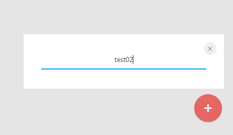
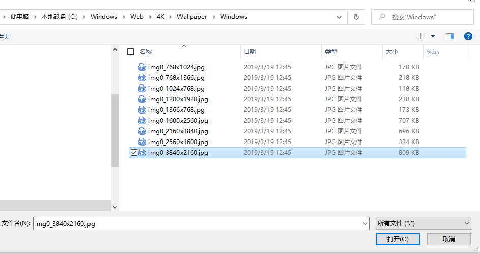
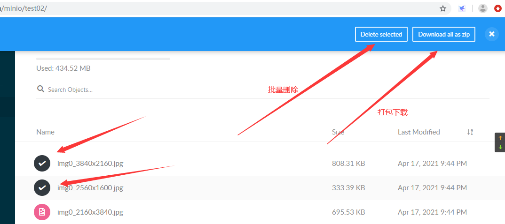

# 测试或生产环境部署

- 个人QQ500人小群：702389581
- github地址： https://github.com/shellgithub/sharedevops.git

| 版本号 | 更新日期   | 更新内容                                                     | 备注                         |
| ------ | ---------- | ------------------------------------------------------------ | ---------------------------- |
| V0.0.4 | 2021-07-27 | 添加bucket、图片上传的基本操作                               | 看完整图文需要打开github链接 |
| V0.0.3 | 2021-07-23 | 集群部署部分的下载链接更新<br />添加nginx https 配置<br />添加 http 301 跳转到 https<br />添加 mc 下载管理 |                              |
| V0.0.2 | 2021-07-14 | 2021-07-12发布新版本，新版本有诸多bug，建议使用老版本： RELEASE.2021-03-26T00-00-41Z，<br />老版本下载地址：<br/>http://dl.minio.org.cn/server/minio/release/linux-amd64/archive/ |                              |
| V0.0.1 | 2021-05-19 | 整理好部署文件及对外展示部分                                 |                              |

## 对象存储 MinIO 部署

### 单机服务器信息

| 序列 | 配置                           | IP          |
| ---- | ------------------------------ | ----------- |
| 1    | 4核/8G/  50G<br />/data1   50G | 192.168.1.5 |

### 集群服务器信息

| 序列 | 配置                                           | IP           | 备注                                  |
| ---- | ---------------------------------------------- | ------------ | ------------------------------------- |
| 1    | 4核/8G/100G<br />/data1 500G<br />/data2  500G | 192.168.0.30 | 部署 minio<br />nginx                 |
| 2    | 4核/8G/100G<br />/data1 500G<br />/data2  500G | 192.168.0.31 | 部署 minio                            |
| 3    | 4核/8G/100G<br />/data1 500G<br />/data2  500G | 192.168.0.32 | 部署 minio                            |
| 4    | 4核/8G/100G                                    | 192.168.0.33 | 部署 rabbitmq<br />依实际情况需要添加 |

## 单机版启动脚本

```
mkdir -p /data/minio/bin/ && cd $_

wget -c http://dl.minio.org.cn/server/minio/release/linux-amd64/minio -O /data/minio/bin/minio

# 下载老版本minio
wget -c http://dl.minio.org.cn/server/minio/release/linux-amd64/archive/minio.RELEASE.2021-03-26T00-00-41Z  -O /data/minio/bin/minio

chmod +x /data/minio/bin/minio

# 查看版本
/data/minio/bin/minio -v
  minio version RELEASE.2021-03-26T00-00-41Z （此版本可以正常使用）


# 单节点启动脚本
[root@aaa bin]# vim /data/minio/bin/minio_onlyone.sh
#!/bin/bash

RUNNING_USER=root
MINIO_HOME=/data/minio
MINIO_BIN=/data/minio/bin/minio
#accesskey and secretkey
ACCESS_KEY=miniominio
SECRET_KEY=miniominio

    START_CMD="MINIO_ACCESS_KEY=${ACCESS_KEY} MINIO_SECRET_KEY=${SECRET_KEY} \
    nohup ${MINIO_BIN} server /data1 --address ":9001" \
    >> ${MINIO_HOME}/minio-9001.log 2>&1 &"
    su - ${RUNNING_USER} -c "${START_CMD}"

chmod +x /data/minio/bin/minio_onlyone.sh

# 启动服务
sh /data/minio/bin/minio_onlyone.sh
```
# 集群版启动脚本

```
在 192.168.0.30 上操作
# 集群启动命令
mkdir -p /data/minio/bin/ && cd $_

wget -c http://dl.minio.org.cn/server/minio/release/linux-amd64/archive/minio.RELEASE.2021-03-26T00-00-41Z  -O /data/minio/bin/minio

# 编辑集群启动脚本
touch /data/minio/bin/minio_admin.sh
chmod +x /data/minio/bin/minio_admin.sh
vim /data/minio/bin/minio_admin.sh

#!/bin/bash

RUNNING_USER=root
MINIO_HOME=/data/minio
MINIO_BIN=/data/minio/bin/minio
#accesskey and secretkey
ACCESS_KEY=miniominio
SECRET_KEY=miniominio

    START_CMD="MINIO_ACCESS_KEY=${ACCESS_KEY} MINIO_SECRET_KEY=${SECRET_KEY} \
    nohup ${MINIO_BIN} server http://192.168.0.{30..32}:9000/data{1..2} > ${MINIO_HOME}/minio-9000.log 2>&1 &"
    su - ${RUNNING_USER} -c "${START_CMD}"


# 启动服务
sh /data/minio/bin/minio_admin.sh
ps aux | grep minio

# 查看日志
tail -f /data/minio/minio-9001.log


# 在 31 32 上创建目录 /data/minio/bin/
for file in {31..32} ; do
  ssh 192.168.0.${file} 'mkdir -p /data/minio/bin/' ; 
done

# 同步文件到 31 32
for IP in 192.168.0.{31..32} ; do
    echo -e "\n\n${IP}\n"
rsync -av /data/minio/ ${ip}:/data/minio/
done

for IP in 192.168.0.{31..32} ; do
    echo -e "\n\n${IP}\n"
    ssh ${IP} 'echo -e "export MINIO_ACCESS_KEY=miniominio\nexport MINIO_SECRET_KEY=miniominio" >> /etc/profile'
done


for IP in 192.168.0.{31..32} ; do
    echo -e "\n\n${IP}\n"
    ssh ${IP} 'cat /etc/profile'
done

# 启动服务
for IP in 192.168.0.{30..32} ; do
    echo -e "\n\n${IP}\n"
    ssh ${IP} 'sh /data/minio/bin/minio_admin.sh'
done

# 查看进程
for IP in 192.168.0.{30..32} ; do
    echo -e "\n\n${IP}\n"
    ssh ${IP} 'ps aux | grep minio'
done

# 查看各机器时间
for IP in 192.168.0.{30..32} ; do
    echo -e "\n\n${IP}\n"
    ssh ${IP} 'date'
done
```

## 重置集群

- 当集群出现数据错乱时使用

```
# 关闭进程

for IP in 192.168.0.{30..32} ; do
    echo -e "\n\n${IP}\n"
    ssh ${IP} 'pkill minio'
done

# 清理文件

for IP in 192.168.0.{30..32} ; do
    echo -e "\n\n${IP}\n"
    ssh ${IP} 'rm -rfv /data1/* /data2/* /home/sa/.minio/'
done

# 启动服务

for IP in 192.168.0.{30..32} ; do
    echo -e "\n\n${IP}\n"
    ssh ${IP} 'sh /data/minio/bin/minio_admin.sh'
done

# 查看进程
for IP in 192.168.0.{30..32} ; do
    echo -e "\n\n${IP}\n"
    ssh ${IP} 'ps aux | grep minio'
done
```

### 配置 nginx 代理服务

#### nginx 安装

- http://nginx.org/en/linux_packages.html#RHEL-CentOS

```
cat > /etc/yum.repos.d/nginx.repo <<ENDF
[nginx-stable]
name=nginx stable repo
baseurl=http://nginx.org/packages/centos/\$releasever/\$basearch/
gpgcheck=1
enabled=1
gpgkey=https://nginx.org/keys/nginx_signing.key
module_hotfixes=true

[nginx-mainline]
name=nginx mainline repo
baseurl=http://nginx.org/packages/mainline/centos/\$releasever/\$basearch/
gpgcheck=1
enabled=0
gpgkey=https://nginx.org/keys/nginx_signing.key
module_hotfixes=true
ENDF

yum-config-manager --enable nginx-stable

rpm --import https://nginx.org/keys/nginx_signing.key

```

```
yum install -y nginx

systemctl start nginx
systemctl enable nginx
```

#### 配置 域名

```
[root@minio conf.d]# vim minio.test.com_upstream.conf
 upstream http_minio {
    # 单机版地址（ 单机和集群 视情况添加 ）
    server 192.168.1.5:9001;
    # 集群地址
    server 192.168.0.30:9001;
    server 192.168.0.31:9001;
    server 192.168.0.32:9001;
}
[root@minio conf.d]# cat minio.test.com.conf
server{
    listen       80;
    server_name  minio.test.com;
    return 301 https://$server_name$request_uri;
    
    access_log  /data/logs/nginx/minio.test.com/minio.test.com_access.log main;
    error_log  /data/logs/nginx/minio.test.com/minio.test.com_error.log;

    ignore_invalid_headers off;
    client_max_body_size 0;
    proxy_buffering off;

    location / {
        proxy_set_header   X-Real-IP $remote_addr;
        proxy_set_header   X-Forwarded-Host  $host:$server_port;
        proxy_set_header   X-Forwarded-For $proxy_add_x_forwarded_for;
        proxy_set_header   X-Forwarded-Proto  $http_x_forwarded_proto;
        proxy_set_header   Host $http_host;

        proxy_connect_timeout 300;
        proxy_http_version 1.1;
        chunked_transfer_encoding off;
        proxy_ignore_client_abort on;

        proxy_pass http://http_minio;
    }
}

[root@minio conf.d]# cat minio.test.com_https.conf
server{
    listen       332;
    server_name  minio.test.com;
    
    access_log  /data/logs/nginx/minio.test.com/minio.test.com_access.log main;
    error_log  /data/logs/nginx/minio.test.com/minio.test.com_error.log;

    ssl_certificate /etc/nginx/keys/minio.test.com.crt;  # 证书可以线上可用的
    ssl_certificate_key /etc/nginx/keys/minio.test.com.key;
    ssl_session_timeout 5m;
    ssl_ciphers ECDHE-RSA-AES128-GCM-SHA256:ECDHE:ECDH:AES:HIGH:!NULL:!aNULL:!MD5:!ADH:!RC4;
    ssl_protocols TLSv1 TLSv1.1 TLSv1.2;
    ssl_prefer_server_ciphers on;
    
    
    ignore_invalid_headers off;
    client_max_body_size 0;
    proxy_buffering off;

    location / {
        proxy_set_header   X-Real-IP $remote_addr;
        proxy_set_header   X-Forwarded-Host  $host:$server_port;
        proxy_set_header   X-Forwarded-For $proxy_add_x_forwarded_for;
        proxy_set_header   X-Forwarded-Proto  $http_x_forwarded_proto;
        proxy_set_header   Host $http_host;

        proxy_connect_timeout 300;
        proxy_http_version 1.1;
        chunked_transfer_encoding off;
        proxy_ignore_client_abort on;

        proxy_pass http://http_minio;
    }
}


```

### 打开 MinIO 管理页面

http://minio.test.com/minio/

- 如使用域名访问，需要解析或 修改 hosts

ACCESS_KEY=miniominio
SECRET_KEY=miniominio

### 创建 bucket，点击右下角的 + 号  -->  Create bucket




### 上传图片


- 只能上传文件，不能上传文件夹



### 批量删除上打包下载，没有全选和反返功能




### mc 下载管理

```
下载最新版
wget https://dl.min.io/client/mc/release/linux-amd64/mc

下载和上面minio 对应版本（ 主要看发布时间差不多就行 ）
wget -c https://dl.min.io/client/mc/release/linux-amd64/archive/mc.RELEASE.2021-03-23T05-46-11Z  -O /data/minio/bin/mc
chmod +x /data/minio/bin/mc


echo 'PATH=$PATH:/data/minio/bin/' >> /etc/profile
echo 'export MINIO_ACCESS_KEY=miniominio' >> /etc/profile
echo 'export MINIO_SECRET_KEY=miniominio' >> /etc/profile

source /etc/profile

# myminio 是 minio server 给的名字，url 是 endpoint，minioadmin 是用户名，密码

mc config host add myminio http://192.168.1.5:9001 miniominio miniominio

```

